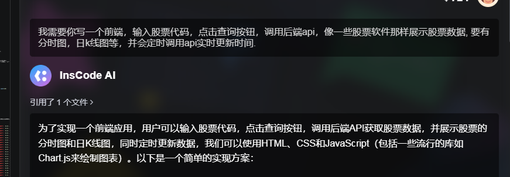
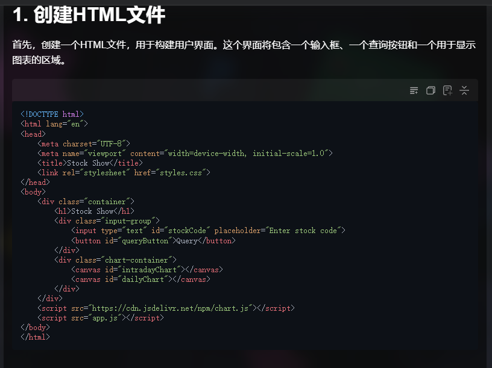
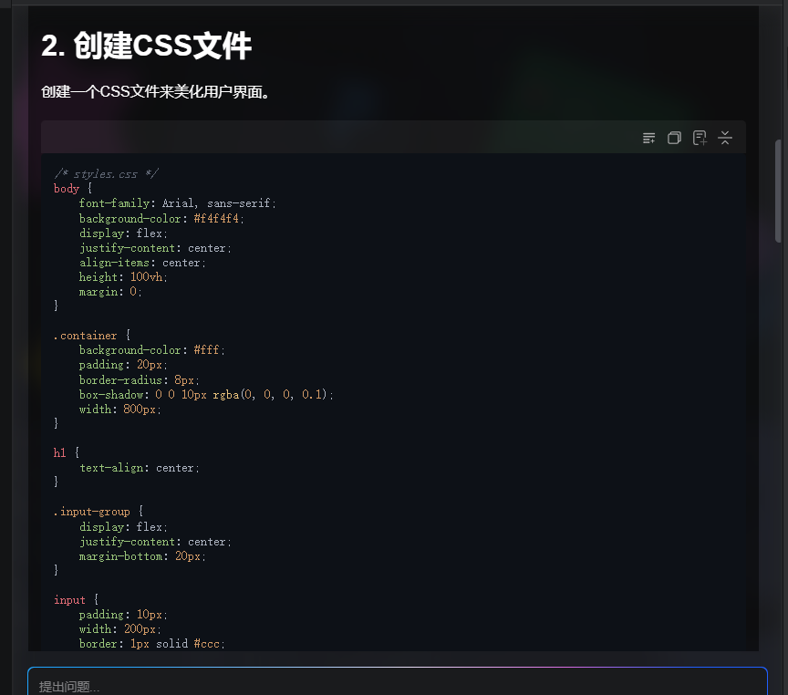
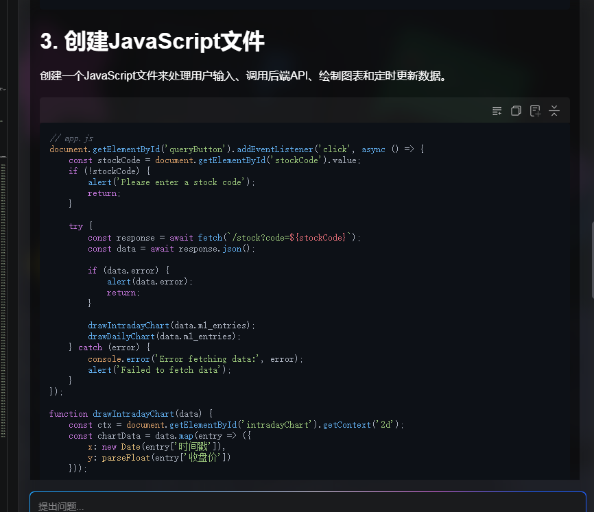
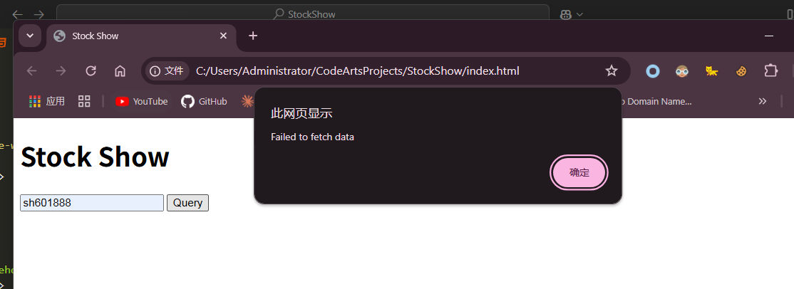

# StockShow

输入股票代码，显示股票实时行情，买卖单。类似股票行情软件的显示效果。

## 功能：

1. 输入股票代码，显示股票实时行情，买卖单。类似股票行情软件的显示效果。
2. 显示股票历史分时图, open, close, high, low, volume

## 总体思路

1. 获取股票分钟线数据
2. 分析并提取股票数据
3. 写后端
4. 前端展示

## Prompts

### 1 获取股票数据

对于第一步，因为 ai 不可能帮我们获取股票数据，所以我们需要自己获取股票数据，获取股票数据。

简单写一个文件获取股票数据,保存为 `get_stock_data.py`

### 2 分析股票数据

手动标注在 yaml 文件字段数据含义, 让 ai 写一个函数提取需要的字段

```yaml
code: 0
data:
  sh601888:
    m1:
      - - "202411251500" # 时间戳，表示2024年11月25日15:00
        - "68.02" # 当前时间开盘价
        - "68.00" # 当前时间收盘价
        - "68.02" # 当前时间最高价
        - "68.00" # 当前时间最低价
        - "4284.00" # 成交量
        - {}
        - "2.19"
    prec: "67.40" # 上一次交易收盘价
    qt:
      market:
        - 2024-11-25 21:46:52|HK_close_已收盘|SH_close_已收盘|SZ_close_已收盘|US_close_未开盘|SQ_close_已休市|DS_close_已休市|ZS_close_已休市|NEWSH_close_已收盘|NEWSZ_close_已收盘|NEWHK_close_已收盘|NEWUS_close_未开盘|REPO_close_已收盘|UK_open_交易中|KCB_close_已收盘|IT_open_交易中|MY_close_已收盘|EU_open_交易中|AH_close_已收盘|DE_open_交易中|JW_close_已收盘|CYB_close_已收盘|USA_close_未开盘|USB_open_盘前交易|ZQ_close_已收盘
          # 各个市场的交易状态，时间戳为2024年11月25日21:46:52
      sh601888: #sh+股票代码
        - "1"
        - 中国中免 # 股票名称
        - "601888" # 股票代码
        - "68.00" # 最新价
        - "67.40" # 昨收
        - "67.60" # 开盘价
        - "148716" # 成交量
        - "78040" # 买入量
        - "70676" # 卖出量
        - "67.99" # 买一价
        - "15" # 买一量
        - "67.98" # 买二价
        - "49" # 买二量
        - "67.97" # 买三价
        - "22" # 买三量
        - "67.96" # 买四价
        - "25" # 买四量
        - "67.95" # 买五价
        - "3" # 买五量
        - "68.00" # 卖一价
        - "139" # 卖一量
        - "68.01" # 卖二价
        - "190" # 卖二量
        - "68.02" # 卖三价
        - "139" # 卖三量
        - "68.03" # 卖四价
        - "34" # 卖四量
        - "68.04" # 卖五价
        - "35" # 卖五量
        - ""
        - "20241125155912" # 时间戳，表示2024年11月25日15:59:12
        - "0.60" # 涨跌额 68- 67.40prec
        - "0.89" # 涨跌幅 (68-67.4)/67.4 0.00890207715133523
        - "68.65" # 最高价
        - "67.45" # 最低价
        - 68.00/148716/1012194591 # 价格/成交量/成交额(元)
        - "148716" # 成交量 148716手
        - "101219" # 成交笔数
        - "0.76" # 换手率
        - "25.92" # 市盈率 TTM
        - ""
        - "68.65" # 最高价
        - "67.45" # 最低价
        - "1.78" # 振幅 index 43
        - "1327.68" # 流通市值
        - "1406.82" # 总市值 1406.82亿元
        - "2.59" # 市净率
        - "74.14" # 涨停
        - "60.66" # 涨跌
        - "0.93" # 量比
        - "-423"
        - "68.06" # 均价
        - "26.92" # 市盈率 动
        - "20.95" # 市盈率 静
        - ""
        - ""
        - "1.60"
        - "101219.4591" # 成交额 w
        - "0.0000"
        - "0"
        - " "
        - GP-A
        - "-17.11"
        - "-2.54"
        - "2.43"
        - "10.01"
        - "8.14"
        - "90.85"
        - "53.52"
        - "-8.64"
        - "-3.27"
        - "12.83"
        - "1952475544" # 总股本 19.52亿股 # 单位股
        - "2068859044" # 流通股本 206885.904 万股 # 单位股
        - "-64.98"
        - "-18.64"
        - "1952475544"
        - ""
        - ""
        - "-24.74"
        - "-0.01"
        - ""
        - CNY # 货币单位
        - "0"
        - ___D__F__N
        - "68.06"
        - "-27"
      zjlx:
        - sh601888
        - "0.00"
        - "0.00"
        - "0.00"
        - "0"
        - "0.00"
        - "0.00"
        - "0.00"
        - "0"
        - "0.00"
        - "0.00"
        - "0.00"
        - 中国中免
        - "20200701"
        - 20200701^0.00^0.00
        - 20200630^0.00^0.00
        - 20200629^0.00^0.00
        - 20200624^0.00^0.00
        - "0.00"
        - "0.00"
        - "20200701085013"
msg: ""
```

#### prompt1:

这是一个字典类型的数据，请写一个函数提取标注了的数据字段，注 m1 实际有很多条各个分钟的股票数据，文件只列举了一条(你不能按一条来提取)，股票代码请换成一个函数变量来索引，字典的 key 是标注的 key，value 是提取的数据，m1 要提取成一个字典列表，按时间正序排序（新的在后）。处理路径和读取文件请使用 pathlib。函数参数不是文件路径，是 obj 类型的字典，第二个参数是股票代码。

#### response1:

ai 给出来的代码还是不能直接用，（没有正确索引到数据），没事稍微改改还能用，保存为 `extract_data.py`

### 3. 写后端

#### prompt2:

我需要你写一个后端api, 收到股票代码后，调用 `get_stock_data.py` 获取股票数据，然后调用 `extract_data.py` 提取数据，返回给前端。`raw_json` 就是 `exextract_data.py`中函数的第一个参数。

#### response2:

ai 使用的是flask,也能用。保存为 `app.py`， 并改动ai代码，固定端口为5000

### 4. 前端展示

#### prompt3:

我需要你写一个前端，输入股票代码，点击查询按钮，调用后端api，像一些股票软件那样展示股票数据, 要有分时图，日k线图等，并会定时调用api实时更新时间.

#### response3

ai 给了三个文件，依次保存为 `index.html`, `styles.css`, `app.js`，并放在同一目录下






不出所料，不能运行


继续prompt

#### prompt4

（选择四个文件的代码 `index.html`, `styles.css`, `app.js`，`app.py`），代码不能正常运行，输入股票代码后提示:`Failed to fetch data`,后端api有没有响应到请求，请检查代码问题。

#### response4

按照ai给的代码文件修改

```js
const response = await fetch(`http://localhost:5000/stock?code=${stockCode}`);
```

依然错误

#### prompt5

（选择四个文件的代码 `index.html`, `styles.css`, `app.js`，`app.py`），代码不能正常运行，输入股票代码后提示:`Failed to fetch data`,但是后端api响应到请求了，请检查代码问题。（其实是跨域错误）

```bash
PS C:\Users\Administrator\CodeArtsProjects\StockShow> python app.py
 * Serving Flask app 'app'
 * Debug mode: on
WARNING: This is a development server. Do not use it in a production deployment. Use a production WSGI server instead.
 * Running on http://127.0.0.1:5000
Press CTRL+C to quit
 * Restarting with stat
 * Debugger is active!
 * Debugger PIN: 744-602-602
127.0.0.1 - - [26/Nov/2024 01:01:17] "GET /stock?code=sh601888 HTTP/1.1" 200 -
127.0.0.1 - - [26/Nov/2024 01:01:23] "GET /stock?code=sh601888 HTTP/1.1" 200 -
127.0.0.1 - - [26/Nov/2024 01:02:15] "GET /stock?code=sh601888 HTTP/1.1" 200 -
```

#### response5

```plain
跨域错误通常是因为浏览器的同源策略限制了从一个域向另一个域发起的请求。要解决这个问题，你需要在后端API中启用CORS（跨域资源共享）。

你可以使用Flask-CORS库来解决这个问题。以下是如何修改你的app.py文件以启用CORS：
```

```bash
pip install flask-cors
```

```python
#app.py
from flask import Flask, request, jsonify
from flask_cors import CORS
from get_stock_data import get_price_min_tx
from extract_data import extract_data

app = Flask(__name__)
CORS(app)  # 启用CORS

@app.route("/stock", methods=["GET"])
def get_stock_info():
    # 获取股票代码
    stock_code = request.args.get("code")
    if not stock_code:
        return jsonify({"error": "Stock code is required"}), 400

    # 调用 get_stock_data.py 获取股票数据
    try:
        raw_json, _ = get_price_min_tx(code=stock_code, minute_frequency=1, count=100)
    except Exception as e:
        return jsonify({"error": str(e)}), 500

    # 调用 extract_data.py 提取数据
    try:
        extracted_data = extract_data(raw_json, stock_code)
    except Exception as e:
        return jsonify({"error": str(e)}), 500

    # 返回提取的数据
    return jsonify(extracted_data)

if __name__ == "__main__":
    app.run(debug=True, port=5000)
```

#### prompt6

（选中文件的代码 `index.html`, `styles.css`, `app.js`）

没有跨域错误了，在网页网络分析也看到后端api数据正常返回了，但是还是显示 `Failed to fetch data`，请检查代码问题。

#### prompt7

网页控制台报错：

```bash
Failed to load resource: net::ERR_FILE_NOT_FOUND了解此错误AI
app.js:17 API response data: Objectm1_entries: (100) [{…}, {…}, {…}, {…}, {…}, {…}, {…}, {…}, {…}, {…}, {…}, {…}, {…}, {…}, {…}, {…}, {…}, {…}, {…}, {…}, {…}, {…}, {…}, {…}, {…}, {…}, {…}, {…}, {…}, {…}, {…}, {…}, {…}, {…}, {…}, {…}, {…}, {…}, {…}, {…}, {…}, {…}, {…}, {…}, {…}, {…}, {…}, {…}, {…}, {…}, {…}, {…}, {…}, {…}, {…}, {…}, {…}, {…}, {…}, {…}, {…}, {…}, {…}, {…}, {…}, {…}, {…}, {…}, {…}, {…}, {…}, {…}, {…}, {…}, {…}, {…}, {…}, {…}, {…}, {…}, {…}, {…}, {…}, {…}, {…}, {…}, {…}, {…}, {…}, {…}, {…}, {…}, {…}, {…}, {…}, {…}, {…}, {…}, {…}, {…}]market_status: (24) ['HK_close_未开盘', 'SH_close_未开盘', 'SZ_close_未开盘', 'US_open_交易中', 'SQ_close_未开盘', 'DS_close_未开盘', 'ZS_close_未开盘', 'NEWSH_close_未开盘', 'NEWSZ_close_未开盘', 'NEWHK_close_未开盘', 'NEWUS_open_交易中', 'REPO_close_未开盘', 'UK_close_已收盘', 'KCB_close_未开盘', 'IT_close_已收盘', 'MY_close_未开盘', 'EU_close_已收盘', 'AH_close_未开盘', 'DE_close_已收盘', 'JW_close_未开盘', 'CYB_close_未开盘', 'USA_close_未开盘', 'USB_close_已收盘', 'ZQ_close_未开盘']stock_details: {买一价: '67.99', 买一量: '15', 买三价: '67.97', 买三量: '22', 买二价: '67.98', …}[[Prototype]]: Object
app.js:33 Error fetching data: Error: This method is not implemented: Check that a complete date adapter is provided.
    at Ln (chart.js:19:103382)
    at En.formats (chart.js:19:103600)
    at No.init (chart.js:19:153520)
    at chart.js:19:92773
    at u (chart.js:13:1237)
    at An.buildOrUpdateScales (chart.js:19:92498)
    at An._updateScales (chart.js:19:95232)
    at An.update (chart.js:19:94395)
    at new An (chart.js:19:90939)
    at drawIntradayChart (app.js:45:3)
（匿名） @ app.js:33了解此错误AI
chart.js:19 Uncaught Error: This method is not implemented: Check that a complete date adapter is provided.
    at Ln (chart.js:19:103382)
    at En.formats (chart.js:19:103600)
    at No.init (chart.js:19:153520)
    at chart.js:19:92773
    at u (chart.js:13:1237)
    at An.buildOrUpdateScales (chart.js:19:92498)
    at An._updateScales (chart.js:19:95232)
    at An.update (chart.js:19:94395)
    at An.<anonymous> (chart.js:19:90767)
    at An._doResize (chart.js:13:5520)了解此错误AI
app.js:17 API response data: {m1_entries: Array(100), market_status: Array(24), stock_details: {…}}
app.js:33 Error fetching data: Error: Canvas is already in use. Chart with ID '0' must be destroyed before the canvas with ID 'intradayChart' can be reused.
    at new An (chart.js:19:89869)
    at drawIntradayChart (app.js:45:3)
    at HTMLButtonElement.<anonymous> (app.js:30:5)
（匿名） @ app.js:33了解此错误AI
```

#### response7

Chart.js日期适配器问题： 错误信息提示需要一个完整的日期适配器。你需要引入并配置一个日期适配器，例如chartjs-adapter-date-fns。

Canvas重复使用问题： 错误信息提示Canvas已经在使用，需要在重新绘制图表之前销毁现有的图表。

#### prompt8

网页控制台报错：

```bash
Failed to load resource: net::ERR_FILE_NOT_FOUND了解此错误AI
app.js:20 API response data: Object
app.js:36 Error fetching data: Error: "candlestick" is not a registered controller.
    at tn._get (chart.js:19:82772)
    at tn.getController (chart.js:19:81840)
    at An.buildOrUpdateControllers (chart.js:19:93826)
    at An.update (chart.js:19:94576)
    at An.<anonymous> (chart.js:19:90767)
    at An._doResize (chart.js:13:5520)
    at An._resize (chart.js:19:92084)
    at An.resize (chart.js:19:91675)
    at a (chart.js:19:100972)
    at An.bindResponsiveEvents (chart.js:19:101120)
```

#### response8

根据错误信息，"candlestick" is not a registered controller，这意味着Chart.js没有注册candlestick图表类型。你需要引入并注册chartjs-chart-financial插件来支持candlestick图表。

以下是修改后的index.html和app.js代码：

修改index.html，引入chartjs-chart-financial插件：

修改app.js，注册candlestick图表类型：

#### prompt9

你是否已经正确提取了数据并将其传递给图表？请仔细看后端返回的数据示例,时间戳不是真的那种标准时间戳，格式只是 `YYYYMMDDHHmm`字符串, 数据展示也要美化一些，页面主体是分时图和分钟k线图：
绘制分钟K线图（蜡烛图）可以使用JavaScript结合ECharts库，
描述分钟K线图
K线图展示每分钟的开盘价、收盘价、最高价、最低价以及成交量，体现价格的波动情况：
开盘价（Open）：该分钟的第一个交易价格。
收盘价（Close）：该分钟的最后一个交易价格。
最高价（High）：该分钟内最高交易价格。
最低价（Low）：该分钟内最低交易价格。
。
右侧是股票详情，下方是市场状态。前五大宗买卖要以排行榜形式展示放在图表旁边，上卖下买。所有数据展示要有动态效果，比如数据更新时有动画效果。整个页面布局尽量紧凑点，主题Material，暗色，卡片形式展示，带有阴影. 并会定时调用api实时更新时间,时间间隔60s。

后端api地址“`http://localhost:5000/stock?code=${stockCode}`
返回：

```json
{
    'm1_entries': [
        {'时间戳': '202411251500', '开盘价': '68.02', '收盘价': '68.00', '最高价': '68.02', '最低价': '68.00', '成交量': '4284.00'},
        {'时间戳': '202411251459', '开盘价': '68.02', '收盘价': '68.02', '最高价': '68.02', '最低价': '68.02', '成交量': '0.00'},
        {'时间戳': '202411251458', '开盘价': '68.02', '收盘价': '68.02', '最高价': '68.02', '最低价': '68.02', '成交量': '18.00'},
        {'时间戳': '202411251457', '开盘价': '68.01', '收盘价': '68.00', '最高价': '68.03', '最低价': '68.00', '成交量': '489.00'},
        {'时间戳': '202411251456', '开盘价': '68.01', '收盘价': '68.00', '最高价': '68.02', '最低价': '68.00', '成交量': '975.00'},
        {'时间戳': '202411251455', '开盘价': '68.02', '收盘价': '68.01', '最高价': '68.02', '最低价': '68.00', '成交量': '820.00'},
        {'时间戳': '202411251454', '开盘价': '68.01', '收盘价': '68.01', '最高价': '68.03', '最低价': '68.01', '成交量': '628.00'},
        {'时间戳': '202411251453', '开盘价': '68.01', '收盘价': '68.01', '最高价': '68.02', '最低价': '67.99', '成交量': '563.00'},
        {'时间戳': '202411251452', '开盘价': '68.00', '收盘价': '68.00', '最高价': '68.01', '最低价': '68.00', '成交量': '629.00'},
        {'时间戳': '202411251451', '开盘价': '68.00', '收盘价': '68.01', '最高价': '68.02', '最低价': '68.00', '成交量': '1282.00'},
        {'时间戳': '202411251450', '开盘价': '68.07', '收盘价': '68.00', '最高价': '68.07', '最低价': '68.00', '成交量': '827.00'},
        {'时间戳': '202411251449', '开盘价': '68.14', '收盘价': '68.08', '最高价': '68.15', '最低价': '68.08', '成交量': '520.00'},
        {'时间戳': '202411251448', '开盘价': '68.12', '收盘价': '68.15', '最高价': '68.15', '最低价': '68.12', '成交量': '581.00'},
        {'时间戳': '202411251447', '开盘价': '68.10', '收盘价': '68.12', '最高价': '68.12', '最低价': '68.09', '成交量': '311.00'},
        {'时间戳': '202411251446', '开盘价': '68.00', '收盘价': '68.09', '最高价': '68.09', '最低价': '68.00', '成交量': '519.00'},
        {'时间戳': '202411251445', '开盘价': '68.07', '收盘价': '68.01', '最高价': '68.07', '最低价': '68.00', '成交量': '358.00'},
        {'时间戳': '202411251444', '开盘价': '68.01', '收盘价': '68.07', '最高价': '68.07', '最低价': '68.00', '成交量': '692.00'},
        {'时间戳': '202411251443', '开盘价': '68.01', '收盘价': '68.00', '最高价': '68.01', '最低价': '67.99', '成交量': '518.00'},
        {'时间戳': '202411251442', '开盘价': '67.97', '收盘价': '68.00', '最高价': '68.00', '最低价': '67.97', '成交量': '480.00'},
        {'时间戳': '202411251441', '开盘价': '67.91', '收盘价': '67.99', '最高价': '67.99', '最低价': '67.91', '成交量': '368.00'},
        {'时间戳': '202411251440', '开盘价': '67.89', '收盘价': '67.90', '最高价': '67.90', '最低价': '67.86', '成交量': '492.00'},
        {'时间戳': '202411251439', '开盘价': '67.86', '收盘价': '67.89', '最高价': '67.91', '最低价': '67.86', '成交量': '364.00'},
        {'时间戳': '202411251438', '开盘价': '67.90', '收盘价': '67.85', '最高价': '67.90', '最低价': '67.82', '成交量': '243.00'},
        {'时间戳': '202411251437', '开盘价': '67.92', '收盘价': '67.89', '最高价': '67.92', '最低价': '67.89', '成交量': '240.00'},
        {'时间戳': '202411251436', '开盘价': '67.86', '收盘价': '67.91', '最高价': '67.91', '最低价': '67.82', '成交量': '244.00'},
        {'时间戳': '202411251435', '开盘价': '67.91', '收盘价': '67.86', '最高价': '67.91', '最低价': '67.81', '成交量': '263.00'},
        {'时间戳': '202411251434', '开盘价': '67.78', '收盘价': '67.91', '最高价': '67.92', '最低价': '67.77', '成交量': '298.00'},
        {'时间戳': '202411251433', '开盘价': '67.65', '收盘价': '67.81', '最高价': '67.81', '最低价': '67.62', '成交量': '464.00'},
        {'时间戳': '202411251432', '开盘价': '67.74', '收盘价': '67.65', '最高价': '67.74', '最低价': '67.61', '成交量': '223.00'},
        {'时间戳': '202411251431', '开盘价': '67.71', '收盘价': '67.74', '最高价': '67.77', '最低价': '67.63', '成交量': '447.00'},
        {'时间戳': '202411251430', '开盘价': '67.75', '收盘价': '67.70', '最高价': '67.78', '最低价': '67.70', '成交量': '376.00'},
        {'时间戳': '202411251429', '开盘价': '67.85', '收盘价': '67.79', '最高价': '67.86', '最低价': '67.76', '成交量': '274.00'},
        {'时间戳': '202411251428', '开盘价': '67.89', '收盘价': '67.85', '最高价': '67.90', '最低价': '67.85', '成交量': '229.00'},
        {'时间戳': '202411251427', '开盘价': '67.80', '收盘价': '67.90', '最高价': '67.92', '最低价': '67.80', '成交量': '411.00'},
        {'时间戳': '202411251426', '开盘价': '67.76', '收盘价': '67.80', '最高价': '67.81', '最低价': '67.76', '成交量': '275.00'},
        {'时间戳': '202411251425', '开盘价': '67.82', '收盘价': '67.80', '最高价': '67.82', '最低价': '67.76', '成交量': '516.00'},
        {'时间戳': '202411251424', '开盘价': '67.72', '收盘价': '67.86', '最高价': '67.86', '最低价': '67.72', '成交量': '286.00'},
        {'时间戳': '202411251423', '开盘价': '67.55', '收盘价': '67.71', '最高价': '67.71', '最低价': '67.55', '成交量': '510.00'},
        {'时间戳': '202411251422', '开盘价': '67.54', '收盘价': '67.56', '最高价': '67.58', '最低价': '67.54', '成交量': '233.00'},
        {'时间戳': '202411251421', '开盘价': '67.56', '收盘价': '67.55', '最高价': '67.56', '最低价': '67.53', '成交量': '195.00'},
        {'时间戳': '202411251420', '开盘价': '67.52', '收盘价': '67.55', '最高价': '67.55', '最低价': '67.52', '成交量': '363.00'},
        {'时间戳': '202411251419', '开盘价': '67.52', '收盘价': '67.52', '最高价': '67.53', '最低价': '67.51', '成交量': '557.00'},
        {'时间戳': '202411251418', '开盘价': '67.50', '收盘价': '67.53', '最高价': '67.53', '最低价': '67.50', '成交量': '933.00'},
        {'时间戳': '202411251417', '开盘价': '67.46', '收盘价': '67.49', '最高价': '67.50', '最低价': '67.45', '成交量': '453.00'},
        {'时间戳': '202411251416', '开盘价': '67.52', '收盘价': '67.46', '最高价': '67.52', '最低价': '67.46', '成交量': '586.00'},
        {'时间戳': '202411251415', '开盘价': '67.56', '收盘价': '67.53', '最高价': '67.56', '最低价': '67.51', '成交量': '513.00'},
        {'时间戳': '202411251414', '开盘价': '67.59', '收盘价': '67.57', '最高价': '67.60', '最低价': '67.56', '成交量': '486.00'},
        {'时间戳': '202411251413', '开盘价': '67.62', '收盘价': '67.60', '最高价': '67.62', '最低价': '67.56', '成交量': '386.00'},
        {'时间戳': '202411251412', '开盘价': '67.75', '收盘价': '67.65', '最高价': '67.77', '最低价': '67.64', '成交量': '917.00'},
        {'时间戳': '202411251411', '开盘价': '67.74', '收盘价': '67.75', '最高价': '67.75', '最低价': '67.73', '成交量': '533.00'},
        {'时间戳': '202411251410', '开盘价': '67.66', '收盘价': '67.74', '最高价': '67.74', '最低价': '67.66', '成交量': '416.00'},
        {'时间戳': '202411251409', '开盘价': '67.65', '收盘价': '67.67', '最高价': '67.67', '最低价': '67.62', '成交量': '816.00'},
        {'时间戳': '202411251408', '开盘价': '67.52', '收盘价': '67.66', '最高价': '67.66', '最低价': '67.50', '成交量': '754.00'},
        {'时间戳': '202411251407', '开盘价': '67.57', '收盘价': '67.50', '最高价': '67.59', '最低价': '67.50', '成交量': '1581.00'},
        {'时间戳': '202411251406', '开盘价': '67.56', '收盘价': '67.57', '最高价': '67.57', '最低价': '67.53', '成交量': '708.00'},
        {'时间戳': '202411251405', '开盘价': '67.61', '收盘价': '67.55', '最高价': '67.61', '最低价': '67.53', '成交量': '805.00'},
        {'时间戳': '202411251404', '开盘价': '67.64', '收盘价': '67.61', '最高价': '67.65', '最低价': '67.60', '成交量': '857.00'},
        {'时间戳': '202411251403', '开盘价': '67.69', '收盘价': '67.65', '最高价': '67.69', '最低价': '67.65', '成交量': '742.00'},
        {'时间戳': '202411251402', '开盘价': '67.72', '收盘价': '67.67', '最高价': '67.73', '最低价': '67.67', '成交量': '827.00'},
        {'时间戳': '202411251401', '开盘价': '67.80', '收盘价': '67.73', '最高价': '67.80', '最低价': '67.73', '成交量': '925.00'},
        {'时间戳': '202411251400', '开盘价': '67.82', '收盘价': '67.80', '最高价': '67.85', '最低价': '67.79', '成交量': '282.00'},
        {'时间戳': '202411251359', '开盘价': '67.82', '收盘价': '67.82', '最高价': '67.85', '最低价': '67.80', '成交量': '247.00'},
        {'时间戳': '202411251358', '开盘价': '67.89', '收盘价': '67.81', '最高价': '67.89', '最低价': '67.81', '成交量': '348.00'},
        {'时间戳': '202411251357', '开盘价': '67.92', '收盘价': '67.91', '最高价': '67.92', '最低价': '67.89', '成交量': '199.00'},
        {'时间戳': '202411251356', '开盘价': '67.92', '收盘价': '67.91', '最高价': '67.93', '最低价': '67.91', '成交量': '254.00'},
        {'时间戳': '202411251355', '开盘价': '67.94', '收盘价': '67.93', '最高价': '67.95', '最低价': '67.89', '成交量': '282.00'},
        {'时间戳': '202411251354', '开盘价': '67.85', '收盘价': '67.95', '最高价': '67.99', '最低价': '67.85', '成交量': '273.00'},
        {'时间戳': '202411251353', '开盘价': '67.91', '收盘价': '67.85', '最高价': '67.91', '最低价': '67.82', '成交量': '251.00'},
        {'时间戳': '202411251352', '开盘价': '68.00', '收盘价': '67.90', '最高价': '68.01', '最低价': '67.90', '成交量': '605.00'},
        {'时间戳': '202411251351', '开盘价': '67.98', '收盘价': '68.00', '最高价': '68.00', '最低价': '67.92', '成交量': '413.00'},
        {'时间戳': '202411251350', '开盘价': '67.79', '收盘价': '67.95', '最高价': '67.95', '最低价': '67.77', '成交量': '1340.00'},
        {'时间戳': '202411251349', '开盘价': '67.81', '收盘价': '67.78', '最高价': '67.81', '最低价': '67.78', '成交量': '610.00'},
        {'时间戳': '202411251348', '开盘价': '67.82', '收盘价': '67.82', '最高价': '67.84', '最低价': '67.81', '成交量': '382.00'},
        {'时间戳': '202411251347', '开盘价': '67.89', '收盘价': '67.83', '最高价': '67.90', '最低价': '67.83', '成交量': '568.00'},
        {'时间戳': '202411251346', '开盘价': '67.89', '收盘价': '67.89', '最高价': '67.92', '最低价': '67.89', '成交量': '376.00'},
        {'时间戳': '202411251345', '开盘价': '67.99', '收盘价': '67.90', '最高价': '67.99', '最低价': '67.90', '成交量': '564.00'},
        {'时间戳': '202411251344', '开盘价': '68.00', '收盘价': '67.98', '最高价': '68.01', '最低价': '67.98', '成交量': '267.00'},
        {'时间戳': '202411251343', '开盘价': '68.01', '收盘价': '68.00', '最高价': '68.01', '最低价': '68.00', '成交量': '264.00'},
        {'时间戳': '202411251342', '开盘价': '68.00', '收盘价': '68.01', '最高价': '68.03', '最低价': '67.99', '成交量': '387.00'},
        {'时间戳': '202411251341', '开盘价': '68.04', '收盘价': '68.00', '最高价': '68.05', '最低价': '68.00', '成交量': '590.00'},
        {'时间戳': '202411251340', '开盘价': '68.07', '收盘价': '68.04', '最高价': '68.09', '最低价': '68.02', '成交量': '371.00'},
        {'时间戳': '202411251339', '开盘价': '68.03', '收盘价': '68.07', '最高价': '68.08', '最低价': '68.03', '成交量': '269.00'},
        {'时间戳': '202411251338', '开盘价': '68.01', '收盘价': '68.03', '最高价': '68.05', '最低价': '68.01', '成交量': '538.00'},
        {'时间戳': '202411251337', '开盘价': '68.06', '收盘价': '68.03', '最高价': '68.06', '最低价': '68.02', '成交量': '147.00'},
        {'时间戳': '202411251336', '开盘价': '68.10', '收盘价': '68.05', '最高价': '68.10', '最低价': '68.05', '成交量': '252.00'},
        {'时间戳': '202411251335', '开盘价': '68.14', '收盘价': '68.08', '最高价': '68.14', '最低价': '68.07', '成交量': '522.00'},
        {'时间戳': '202411251334', '开盘价': '68.10', '收盘价': '68.14', '最高价': '68.14', '最低价': '68.10', '成交量': '174.00'},
        {'时间戳': '202411251333', '开盘价': '68.05', '收盘价': '68.11', '最高价': '68.15', '最低价': '68.05', '成交量': '410.00'},
        {'时间戳': '202411251332', '开盘价': '68.02', '收盘价': '68.05', '最高价': '68.16', '最低价': '68.01', '成交量': '611.00'},
        {'时间戳': '202411251331', '开盘价': '68.26', '收盘价': '68.02', '最高价': '68.26', '最低价': '68.01', '成交量': '694.00'},
        {'时间戳': '202411251330', '开盘价': '68.21', '收盘价': '68.25', '最高价': '68.26', '最低价': '68.20', '成交量': '329.00'},
        {'时间戳': '202411251329', '开盘价': '68.18', '收盘价': '68.21', '最高价': '68.21', '最低价': '68.18', '成交量': '449.00'},
        {'时间戳': '202411251328', '开盘价': '68.18', '收盘价': '68.18', '最高价': '68.20', '最低价': '68.16', '成交量': '112.00'},
        {'时间戳': '202411251327', '开盘价': '68.23', '收盘价': '68.20', '最高价': '68.24', '最低价': '68.14', '成交量': '271.00'},
        {'时间戳': '202411251326', '开盘价': '68.13', '收盘价': '68.22', '最高价': '68.25', '最低价': '68.13', '成交量': '996.00'},
        {'时间戳': '202411251325', '开盘价': '68.13', '收盘价': '68.13', '最高价': '68.13', '最低价': '68.11', '成交量': '266.00'},
        {'时间戳': '202411251324', '开盘价': '68.14', '收盘价': '68.13', '最高价': '68.14', '最低价': '68.13', '成交量': '195.00'},
        {'时间戳': '202411251323', '开盘价': '68.18', '收盘价': '68.12', '最高价': '68.18', '最低价': '68.10', '成交量': '309.00'},
        {'时间戳': '202411251322', '开盘价': '68.17', '收盘价': '68.17', '最高价': '68.20', '最低价': '68.15', '成交量': '307.00'},
        {'时间戳': '202411251321', '开盘价': '68.22', '收盘价': '68.16', '最高价': '68.23', '最低价': '68.16', '成交量': '581.00'}
    ],
    'market_status': [
        'HK_close_未开盘',
        'SH_close_未开盘',
        'SZ_close_未开盘',
        'US_open_交易中',
        'SQ_close_未开盘',
        'DS_close_未开盘',
        'ZS_close_未开盘',
        'NEWSH_close_未开盘',
        'NEWSZ_close_未开盘',
        'NEWHK_close_未开盘',
        'NEWUS_open_交易中',
        'REPO_close_未开盘',
        'UK_close_已收盘',
        'KCB_close_未开盘',
        'IT_close_已收盘',
        'MY_close_未开盘',
        'EU_close_已收盘',
        'AH_close_未开盘',
        'DE_close_收市竞价中',
        'JW_close_未开盘',
        'CYB_close_未开盘',
        'USA_close_未开盘',
        'USB_close_已收盘',
        'ZQ_close_未开盘'
    ],
    'stock_details': {
        '股票名称': '中国中免',
        '股票代码': '601888',
        '最新价': '68.00',
        '昨收': '67.40',
        '开盘价': '67.60',
        '成交量': '148716',
        '买入量': '78040',
        '卖出量': '70676',
        '买一价': '67.99',
        '买一量': '15',
        '买二价': '67.98',
        '买二量': '49',
        '买三价': '67.97',
        '买三量': '22',
        '买四价': '67.96',
        '买四量': '25',
        '买五价': '67.95',
        '买五量': '3',
        '卖一价': '68.00',
        '卖一量': '139',
        '卖二价': '68.01',
        '卖二量': '190',
        '卖三价': '68.02',
        '卖三量': '139',
        '卖四价': '68.03',
        '卖四量': '34',
        '卖五价': '68.04',
        '卖五量': '35',
        '时间戳': '20241125155912',
        '涨跌额': '0.60',
        '涨跌幅': '0.89',
        '最高价': '68.65',
        '最低价': '67.45',
        '价格/成交量/成交额(元)': '68.00/148716/1012194591',
        '成交量(手)': '148716',
        '成交笔数': '101219',
        '换手率': '0.76',
        '市盈率(TTM)': '25.92',
        '振幅': '1.78',
        '总股本': '1406.82',
        '流通股本': '1327.68'
    }
}
```

#### response9

代码稍微改改能用

#### prompt10

描述一下一个好看的看股页面该有的样式和数据展板以及数据展板该用的布局。（改改然后作为下一个的prompt

#### prompt11

变布局要紧凑一点, 可以多使用flex
页面风格样式

1. 配色方案
   主色调：简洁明快，使用深蓝、深灰或白色背景。
   高亮颜色：红色（上涨）、绿色（下跌）、黄色（平盘）。
   辅助颜色：浅灰、浅蓝，用于分隔线或非重点信息。
2. 字体样式
   字体：无衬线字体（如 Arial、Roboto），体现现代感和清晰感。
   字号：价格、涨跌幅等重要信息大字体加粗；次要信息用小字体。
3. 动效和交互
   鼠标悬停显示更多细节。
   分时图、K线图可以动态更新。
   提供数据放大或切换时段（1分钟、5分钟、日线）的动画过渡效果。

基于这些分钟级的股票行情数据（m1_entries），你可以使用以下布局方式来展示和分析数据：

1. 时间序列趋势图
   绘制开盘价、收盘价、最高价、最低价的时间序列折线图，以直观呈现价格的变化趋势。

X轴: 时间戳（需要将其转换为标准时间格式）
Y轴: 价格
图例: 各价格类别（开盘价、收盘价、最高价、最低价）
2. 成交量柱状图
绘制成交量随时间变化的柱状图，叠加在价格折线图下方。

X轴: 时间戳
Y轴: 成交量
3. K线图（蜡烛图）
将数据转换为标准的K线图格式，显示每分钟的开盘、收盘、最高和最低价格，以及成交量。

使用工具：mplfinance、plotly 等 Python 库可以快速绘制交互式的K线图。
4. 数据表
展示原始数据表格，用于对照图表或详细分析：

列: 时间戳、开盘价、收盘价、最高价、最低价、成交量
可增加筛选功能，比如按时间段或价格范围过滤。
5. 关键指标分析
计算并展示一些重要的交易指标，如：

价格波动: （最高价 - 最低价）/ 开盘价
成交量变化率: 当前成交量 / 前一条成交量
累计成交量: 从首条记录累积至当前记录的总成交量
6. 统计数据概览
在页面顶部展示一些汇总信息：

时间范围（首尾时间戳）
最大、最小、平均开盘价和收盘价
成交量总和和峰值
7. 热力图（成交量分布）
创建以时间戳为行、价格区间为列的热力图，颜色表示该区间内的成交量大小。
便于识别热点价格区间。

以下是推荐的布局方式，使用响应式设计，兼顾桌面端和移动端：

1. 顶部导航栏
   内容：页面切换按钮（分时图、K线图、新闻等）。
   风格：简洁的横向导航条。
2. 主要展示区域
   左侧（宽度约 70%）：价格走势图（分时图/K线图）+ 成交量柱状图。
   右侧（宽度约 30%）：
   股票基本信息。
   实时盘口数据。
   技术指标（可切换）。
3. 底部扩展区域
   内容：资金流向、股东持仓、相关新闻公告。
   布局：卡片式横向滑动，标题为主，点击展开详细信息。


#### prompt12

我希望图表能点击放大到整个窗口大小以看清具体数据

#### End

然后做点修改就差不多了